# romance-architecture

The **map and contracts** for the Romance Project — how the independently-deployed systems fit together. This repo holds **no runtime code**: it is the single home for the cross-cutting architecture and the boundary contracts that no single system repo owns.

Start here: **[docs/ARCHITECTURE.md](docs/ARCHITECTURE.md)**.

## The systems

| Repo | Role | Notes |
|------|------|-------|
| **romance-training** (RT) | Trains style models — judge / classifier / rewriter today; editor+writer products planned | Leech & Short rubric + labeled corpus; ships artifacts RF consumes (style RAG, rubric) |
| **romance-factory** (RF) | Harness — 15-phase draft→grade→revise→bundle pipeline | Story-frame world cards; LanceDB RAG; emits story bundles + provenance |
| **romance-voice** (RV) | Audiobook TTS — Spark-resident VoxCPM | RF/RT upload → MP3; HTTP `:8081` / tunnel `:18081` |
| **romance-monitor** (RM) | Live generate dashboard — LAN GUI for parallel RF runs | Fail-open ingest from RF; not on the reader/training path |
| **midnight-satin** (MS) | Frontend — readers read, unlock, review, comment | Next.js / Vercel / Neon; captures reader signal |

```
RT ──(models + card schema + rubric)──▶ RF ──(story bundle + assets + audio/)──▶ MS ──▶ readers
                                         │ ▲                                          │
                                         ├─┴─ RV (audiobook MP3 + paragraph cues)     │
                                         └──── RM (live telemetry; fail-open)           │
 ▲                                                                                    │
 └───── feedback: RF machine signal (grades) + MS human signal (reads) ───────────────┘
```

## End-to-end lifecycle (step by step)

The full loop: **RT trains the models → RF writes and grades a book → the book is bundled for MS → readers generate signal → that signal (plus RF's own grades) calibrates the next RT model, which ships back to RF.** Numbers on the nodes are the step order.

**Legend:** solid **thick** arrows are the *shipped, forward* artifact path; **dashed** arrows are the *feedback loops*, which are mostly **greenfield** today. **RF emits** `story_id` + `provenance/` (RF-1 / RF-2); **MS ingest of provenance and audiobook** are still open (MS-1 / MS-3 / MS-4). RT-1 model-version stamps remain open. Grounded in [docs/ARCHITECTURE.md](docs/ARCHITECTURE.md), [docs/PROVENANCE.md](docs/PROVENANCE.md), [docs/contracts/AUDIOBOOK.md](docs/contracts/AUDIOBOOK.md), RT `README.md` / `docs/LLM-Backends.md`, and RF `docs/design/` + `hub_registry.py`.

```mermaid
flowchart TB
  %% ===================== RT — model factory =====================
  subgraph RT["romance-training (RT) — style model factory"]
    direction TB
    T1["1 Label real prose<br/>Leech & Short rubric + Style-in-Fiction RAG"]
    T2["2 Trusted style labels<br/>+ shared steering_card schema"]
    T3["3 SFT / LoRA<br/>judge·classifier today; editor + writer products planned"]
    JUDGE["Judge / classifier<br/>held-out referee"]
    EDITOR["Editor<br/>grade + rewrite (planned product)"]
    WRITER["Writer<br/>card-conditioned + voice/genre LoRA (planned)"]
    T4{"4 Quality gate<br/>style benchmark / bake-off"}
    T5["5 Export GGUF / LoRA<br/>+ card schema + rubric_version"]
    T1 --> T2 --> T3
    T3 --> JUDGE
    T3 --> EDITOR
    T3 --> WRITER
    JUDGE --> T4
    EDITOR --> T4
    WRITER --> T4
    T4 -->|pass| T5
    T4 -->|fail| T3
  end

  %% ===================== RF — the harness =====================
  subgraph RF["romance-factory (RF) — the harness (15-phase pipeline)"]
    direction TB
    F1["6 Plan (phases 2–7)<br/>author, story-frame world cards, place-anchored cast,<br/>12-beat arc, outline + per-act steering card"]
    F2["7 Draft (phase 8)<br/>Writer drafts each act under its card,<br/>RAG context from LanceDB"]
    F3["8 Grade (phase 10)<br/>Editor/Judge: rubric + style → card-hit + score"]
    F4{"9 Pass threshold?"}
    F5["10 Revise (phase 11)<br/>surgical editor + weakest-first rewrite"]
    F6["11 Merge (phases 9,12–14)<br/>stitch acts → chapters → manuscript<br/>+ canon + reader panel"]
    F7["12 Record provenance<br/>story_id, acts[], card_id, adapter,<br/>grades, act-to-chapter stitch offsets"]
    F1 --> F2 --> F3 --> F4
    F4 -->|no| F5 --> F3
    F4 -->|yes| F6 --> F7
    RM["romance-monitor<br/>live phase/prompt/stream tiles"]
    F2 -.->|fail-open POST /ingest| RM
  end

  %% ===================== Publish prep =====================
  subgraph PACK["Publish prep for MS (RF phase 15/15b) + required RV audiobook"]
    direction TB
    B1["13 Phase 15 assets<br/>SDXL cover + portraits,<br/>publish_manifest.json"]
    RV["14 romance-voice (RV)<br/>upload story → VoxCPM on Spark<br/>→ audio/ + audio_manifest (paragraph cues)"]
    B2["15 Phase 15b bundle<br/>chapters + dossiers + images<br/>+ provenance/ (+ audio/ when RF-5 lands)"]
    B1 --> RV --> B2
  end

  %% ===================== MS — frontend =====================
  subgraph MS["midnight-satin (MS) — the frontend (Vercel / Neon)"]
    direction TB
    M1["16 Import to Neon<br/>novels.rf_story_id + chapters.rf_provenance (acts[]) — MS-1 open<br/>+ audiobook assets / metadata — MS-3 open"]
    M2["17 Readers read, unlock chapters (Veil), unlock audiobook (1 credit), review, comment"]
    M3["18 Capture reader signal<br/>reading_progress, chapter_unlocks, audiobook_unlocks,<br/>reviews, paperback_orders"]
    M1 --> M2 --> M3
  end

  %% ===================== Feedback / calibration =====================
  subgraph LOOP["Feedback -> calibration -> next model (greenfield)"]
    direction TB
    L1["19 Join on provenance<br/>reader outcome joins acts[]/card/adapter/grades<br/>de-confound: is_featured, paywall, promotion"]
    L2["20 Calibration report<br/>do editor/judge scores predict<br/>reader completion and unlocks?"]
    L3["21 Curated, de-confounded preference data<br/>gated, calibration-first (DEC-1)"]
    L1 --> L2 --> L3
  end

  %% forward artifact path (shipped / partial)
  T5 ==>|"models + card schema + rubric"| F1
  F7 --> B1
  B2 ==>|"story bundle + provenance (+ audio)"| M1

  %% feedback loops (greenfield)
  F3 -.->|"machine signal: grades, card + adapter used"| L1
  M3 -.->|"human signal: reads, drop-off, unlocks"| L1
  L3 -.->|"retrain writer/editor (judge stays held out)"| T3
```



**Reading the loop by stage:**

1. **RT builds the models (steps 1-5).** Prose is labeled against the Leech & Short rubric (Style-in-Fiction RAG). Today RT ships a **style judge/classifier** (Mistral-Nemo QLoRA path) plus the rubric + knowledge corpus RF embeds for Editor-RAG. Separate **editor** and **writer** training products (and Gemma 4 MoE serving on Spark) remain the target shape — see [ARCHITECTURE.md](docs/ARCHITECTURE.md). A quality gate (style benchmark / bake-off) precedes export of **GGUF/LoRA + card schema + rubric version**.
2. **RF writes a book (steps 6-12).** RF runs its **15-phase** pipeline: plan (author → **story-frame world cards** → place-anchored cast → 12-beat arc → outline) → **draft** each act under its steering card → **grade** → **revise** weakest-first → assemble chapters, canon, reader panel, and record per-act **provenance** keyed by `story_id`. Optionally, **romance-monitor** shows live prompts/streams (fail-open).
3. **RF bundles for MS (steps 13-15).** Phase 15 generates cover/portraits and `publish_manifest.json`; **romance-voice** narrates on Spark (VoxCPM) into `audio/` + `audio_manifest.json` with **paragraph cues**; phase 15b packages chapters, dossiers, images, and provenance into `romance-bundle.zip`. Audiobook in the zip is still **RF-5** ([contracts/AUDIOBOOK.md](docs/contracts/AUDIOBOOK.md)).
4. **MS publishes and listens (steps 16-18).** MS imports the bundle to Neon. **Provenance columns and audiobook player are not in MS yet** (MS-1 / MS-3 / MS-4). Readers unlock chapters via The Veil; audiobook is contracted as **1 credit**, Veil-capped, paragraph jump-sync, background play.
5. **The signal calibrates the next model (steps 19-21).** RF grades and MS human signal join through provenance after MS-1 + RT-1 land; de-confounded calibration first, then gated preference data. The **judge is held out** from this reward loop by design.

## Why this repo exists

The systems are coupled by **contracts**, not shared code, and each deploys independently (MS is on Vercel). A monorepo would break independent CI/deploy. So this is a **thin meta-repo**: cross-cutting docs + contracts + a manifest of the other repos. Pin exact commits in [`manifest.yaml`](manifest.yaml) when you need a reproducible known-good tuple.

## Layout

```
docs/
  ARCHITECTURE.md   # the map: systems, forward flow, feedback loops, principles
  PROVENANCE.md     # per-story provenance contract (RT→RF→MS) — the loop's prerequisite
  BACKLOG.md        # cross-system task origination board (what's blocking convergence)
  contracts/
    STEERING_CARD.md  # canonical steering-card shape + cascade (RT vocab → RF authoring)
    IDENTIFIERS.md    # story→chapter→act→span hierarchy, ids, act→chapter stitch offsets
    AUDIOBOOK.md      # bundle audio/, paragraph cues, 1-credit unlock, Veil gate, jump-sync
manifest.yaml       # repo URLs + current known-good commit of each system (RT, RF, RM, MS, RV)
scripts/
  clone-all.sh      # clone/pull all sibling repos into the expected layout
```

## Clone the whole project

```bash
# from the directory that should contain all repos as siblings
bash romance-architecture/scripts/clone-all.sh
```

## What's next

**RF-1 / RF-2 are shipped** (`story_id`, `provenance/` with act stitch offsets). **MS-1 is still open** — Midnight Satin does not yet store `rf_story_id` / `rf_provenance`. **RT-1** (stable version ids on shipped artifacts) remains open. Audiobook: **RV-1 live synth is done**; alignment (RV-2) + RF/MS wiring remain P1. See [docs/BACKLOG.md](docs/BACKLOG.md) and [docs/PROVENANCE.md](docs/PROVENANCE.md).
