# romance-architecture

The **map and contracts** for the Romance Project — how the independently-deployed systems fit together. This repo holds **no runtime code**: it is the single home for the cross-cutting architecture and the boundary contracts that no single system repo owns.

Start here: **[docs/ARCHITECTURE.md](docs/ARCHITECTURE.md)**.

## The systems

| Repo | Role | Notes |
|------|------|-------|
| **romance-training** (RT) | Trains the models — judge, editor, writer | Gemma 4 MoE on DGX Spark; ships artifacts + contracts |
| **romance-factory** (RF) | Harness — runs models, drafts→grades→revises→merges books | Produces story bundles |
| **romance-voice** (RV) | Audiobook TTS — Spark-resident VoxCPM | RF/RT upload → MP3; HTTP `:8081` / tunnel `:18081` |
| **midnight-satin** (MS) | Frontend — readers read, unlock, review, comment | Next.js / Vercel / Neon; captures reader signal |

```
RT ──(models + card schema + rubric)──▶ RF ──(story bundle + assets + audio/)──▶ MS ──▶ readers
                                         │ ▲                                          │
                                         └─┴─ RV (audiobook MP3 + paragraph cues)     │
 ▲                                                                                    │
 └───── feedback: RF machine signal (grades) + MS human signal (reads) ───────────────┘
```

## End-to-end lifecycle (step by step)

The full loop: **RT trains the models → RF writes and grades a book → the book is bundled for MS → readers generate signal → that signal (plus RF's own grades) calibrates the next RT model, which ships back to RF.** Numbers on the nodes are the step order.

**Legend:** solid **thick** arrows are the *shipped, forward* artifact path; **dashed** arrows are the *feedback loops*, which are mostly **greenfield** today (the RF→MS prose provenance handoff is real; audiobook ingest/player and the MS→RT export/calibration are not built yet, and RT-1 model-version stamps are still open). Grounded in [docs/ARCHITECTURE.md](docs/ARCHITECTURE.md), [docs/PROVENANCE.md](docs/PROVENANCE.md), [docs/contracts/AUDIOBOOK.md](docs/contracts/AUDIOBOOK.md), RT `docs/MOE_WRITER.md` / `docs/MOE_STYLE_EDITOR.md`, and RF `docs/SYSTEM_SUMMARY.md`.

```mermaid
flowchart TB
  %% ===================== RT — model factory =====================
  subgraph RT["romance-training (RT) — the model factory (DGX Spark)"]
    direction TB
    T1["1 Teacher council<br/>3 prompt-variant judges + arbitrator<br/>label real prose (Gutenberg/romance)"]
    T2["2 Trusted style labels<br/>+ Leech & Short rubric<br/>+ shared steering_card schema"]
    T3["3 SFT on Gemma 4 26B-A4B MoE (LoRA)<br/>3 separate products — never cross-trained"]
    JUDGE["Judge<br/>held-out referee"]
    EDITOR["Editor<br/>grade + rewrite"]
    WRITER["Writer<br/>card-conditioned MoE + voice/genre LoRA"]
    T4{"4 Phase 5A bake-off<br/>quality gate"}
    T5["5 Export GGUF Q4/Q5<br/>+ LoRA adapters<br/>+ card schema + rubric_version"]
    T1 --> T2 --> T3
    T3 --> JUDGE
    T3 --> EDITOR
    T3 --> WRITER
    JUDGE --> T4
    EDITOR --> T4
    WRITER --> T4
    T4 -->|pass| T5
    T4 -->|fail| T3
  end

  %% ===================== RF — the harness =====================
  subgraph RF["romance-factory (RF) — the harness (14-phase pipeline)"]
    direction TB
    F1["6 Plan (phases 2-7)<br/>author, world, characters, 12-beat arc,<br/>outline with a per-act steering card"]
    F2["7 Draft (phase 8)<br/>Writer+adapter drafts each act under its card,<br/>RAG context from LanceDB"]
    F3["8 Grade (phase 10)<br/>Editor/Judge: rubric grader + style grader<br/>-> card-hit + score"]
    F4{"9 Pass threshold?"}
    F5["10 Revise (phase 11)<br/>surgical editor + weakest-first rewrite loop"]
    F6["11 Merge (phases 9,12)<br/>stitch ordered acts -> chapters -> manuscript"]
    F7["12 Record provenance<br/>story_id, acts[], card_id, adapter,<br/>grades, act-to-chapter stitch offsets"]
    F1 --> F2 --> F3 --> F4
    F4 -->|no| F5 --> F3
    F4 -->|yes| F6 --> F7
  end

  %% ===================== Publish prep =====================
  subgraph PACK["Publish prep for MS (RF phases 12-15b) + required RV audiobook"]
    direction TB
    B1["13 Phase 15 assets<br/>SDXL cover + portraits (mac mini),<br/>publish_manifest.json"]
    RV["14 romance-voice (RV)<br/>upload story → VoxCPM on Spark<br/>→ audio/ + audio_manifest (paragraph cues)"]
    B2["15 Phase 15b bundle<br/>chapters + dossiers + images<br/>+ provenance/ + audio/ → romance-bundle.zip"]
    B1 --> RV --> B2
  end

  %% ===================== MS — frontend =====================
  subgraph MS["midnight-satin (MS) — the frontend (Vercel / Neon)"]
    direction TB
    M1["16 Import to Neon<br/>novels.rf_story_id + chapters.rf_provenance (acts[])<br/>+ audiobook assets / metadata"]
    M2["17 Readers read, unlock chapters (Veil), unlock audiobook (1 credit), review, comment"]
    M3["18 Capture reader signal<br/>reading_progress, chapter_unlocks, audiobook_unlocks,<br/>reviews, paperback_orders"]
    M1 --> M2 --> M3
  end

  %% ===================== Feedback / calibration =====================
  subgraph LOOP["Feedback -> calibration -> next model (greenfield)"]
    direction TB
    L1["19 Join on provenance<br/>reader outcome joins acts[]/card/adapter/grades<br/>de-confound: is_featured, paywall, promotion"]
    L2["20 Calibration report<br/>do editor/judge scores predict<br/>reader completion and unlocks?"]
    L3["21 Curated, de-confounded preference data<br/>gated, calibration-first (DEC-1)"]
    L1 --> L2 --> L3
  end

  %% forward artifact path (shipped)
  T5 ==>|"models + card schema + rubric"| F1
  F7 --> B1
  B2 ==>|"story bundle + provenance + audio"| M1

  %% feedback loops (greenfield)
  F3 -.->|"machine signal: grades, card + adapter used"| L1
  M3 -.->|"human signal: reads, drop-off, unlocks"| L1
  L3 -.->|"retrain writer/editor (judge stays held out)"| T3
```



**Reading the loop by stage:**

1. **RT builds the models (steps 1-5).** A *teacher council* (three prompt-variant judges + an arbitrator) labels real human prose against the Leech & Short rubric. Those trusted labels train three *separate* products on one Gemma 4 26B-A4B MoE base — **judge** (referee), **editor** (grade + rewrite), **writer** (card-conditioned generator with swappable voice/genre LoRA adapters). A Phase 5A bake-off gates quality, then RT exports **GGUF quantizations + LoRA adapters + the card schema + rubric version**.
2. **RF writes a book (steps 6-12).** RF loads the models and runs its 14-phase pipeline: plan → **draft** each act under its steering card → **grade** with the editor/judge → **revise** weakest-first (surgical editor + rewrite loop) until it clears the threshold → **merge** acts into chapters, and record per-act **provenance** keyed by `story_id`.
3. **RF bundles for MS (steps 13-15).** Phase 15 generates the SDXL cover/portraits and `publish_manifest.json`; **romance-voice** narrates the story on Spark (VoxCPM) into `audio/` + `audio_manifest.json` with **paragraph cues**; phase 15b packages chapters, dossiers, images, provenance, and audio into a portable `romance-bundle.zip` ([contracts/AUDIOBOOK.md](docs/contracts/AUDIOBOOK.md)).
4. **MS publishes and listens (steps 16-18).** MS imports the bundle to Neon (storing `rf_story_id` + `rf_provenance` + audiobook assets). Readers unlock chapters via The Veil and may spend **1 credit** for the novel audiobook; the reading room plays narration only through unlocked chapters, **jumps to the paragraph** about to be read, and continues in the **background**.
5. **The signal calibrates the next model (steps 19-21).** RF's machine grades and MS's human signal join back through provenance, get de-confounded, and produce a calibration report; only *after* the proxies are calibrated does gated, curated preference data flow into RT to retrain the writer/editor — producing the next LoRA+MoE GGUF that ships back to RF at step 5. The **judge is held out** from this reward loop by design.

## Why this repo exists

The systems are coupled by **contracts**, not shared code, and each deploys independently (MS is on Vercel). A monorepo would break independent CI/deploy. So this is a **thin meta-repo**: cross-cutting docs + contracts + a manifest of the other repos. Pin exact commits in [`manifest.yaml`](manifest.yaml) when you need a reproducible known-good tuple.

## Layout

```
docs/
  ARCHITECTURE.md   # the map: systems, forward flow, feedback loops, principles
  PROVENANCE.md     # per-story provenance contract (RT→RF→MS) — the loop's prerequisite
  BACKLOG.md        # cross-system task origination board (what's blocking convergence)
  contracts/
    STEERING_CARD.md  # canonical steering-card shape + cascade (RT vocab → RF authoring)
    IDENTIFIERS.md    # story→chapter→act→span hierarchy, ids, act→chapter stitch offsets
    AUDIOBOOK.md      # bundle audio/, paragraph cues, 1-credit unlock, Veil gate, jump-sync
manifest.yaml       # repo URLs + current known-good commit of each system (RT, RF, MS, RV)
scripts/
  clone-all.sh      # clone/pull all sibling repos into the expected layout
```

## Clone the whole project

```bash
# from the directory that should contain all repos as siblings
bash romance-architecture/scripts/clone-all.sh
```

## What's next

The RF→MS provenance handoff is **shipped** (`story_id`, `provenance/`, `rf_story_id` / `rf_provenance`). The remaining P0 identity gap is **RT-1**: stable version ids on shipped training artifacts so outcomes can be attributed to a model *version*. See [docs/BACKLOG.md](docs/BACKLOG.md) and [docs/PROVENANCE.md](docs/PROVENANCE.md).


---

## Combinatorial design space

The romance-factory's story generation draws from **six independent axes** defined across `romance-themes` and `romance-archetypes`. Each story selects one value per axis (with two independent character slots), producing an astronomically large configuration space that ensures virtually no two generated stories share the same structural DNA.

### The axes

| # | Axis | Source repo | Source file | Count |
|---|------|-------------|-------------|------:|
| 1 | **World Setting** | romance-themes | `artifacts/world_settings.json` | 18 |
| 2 | **Plot Function** | romance-themes | `artifacts/plot_functions.json` | 10 |
| 3 | **Romance Trope** | romance-themes | `artifacts/romance_tropes.json` | 11 |
| 4 | **Character Trope** (per character) | romance-themes | `artifacts/character_tropes.json` | 28 |
| 5 | **Personality Archetype Combo** (per character) | romance-archetypes | `artifacts/combos.json` | 153 |

The personality combos are pair-wise compositions of **13 archetype foundations** (e.g. `aristocrat-noble + carefree-casual` → "Effortless Sovereign"). The 153 combos represent the full set of ordered pairings currently generated.

### What each axis contributes

```
World Setting        → WHERE the story takes place (zombie-apocalypse, epic-space-opera, small-fantasy-village…)
Plot Function        → WHAT HAPPENS structurally (dungeon-adventure, the-long-journey, cinderella-story…)
Romance Trope        → HOW the romance unfolds (enemies-to-lovers, fake-dating, boss-employee…)
Character Trope      → WHO the characters are in the world (maid-butler, paranormal-vampire, mob-heir…)
Personality Combo    → HOW the characters behave and love (Effortless Sovereign, Scorched Baron, Silent Devotee…)
```

### Total combinatorial space

A single romance story requires selecting: one world, one plot, one romance trope, and for **each** of the two lead characters, one character trope and one personality combo.

```
  World Settings           18
× Plot Functions           10
× Romance Tropes           11
× Character Trope (A)      28
× Personality Combo (A)   153
× Character Trope (B)      28
× Personality Combo (B)   153
─────────────────────────────────
= 36,351,022,080 unique configurations
```

**~36.35 billion** structurally distinct romance plots — before accounting for any narrative variation within each configuration.

### Example configuration

> A **boss-employee** romance with a **superheroes + mistaken-identity** plot in a **zombie-apocalypse** setting, featuring a **fortunately-unlucky** character paired with a **maid-butler** — where the first is a *Carefree Aristocrat* (`aristocrat-noble + carefree-casual`) chasing a *Secretive Noble* (`aristocrat-noble + secretive-enigma`).

Each axis is independently authored and versioned, meaning adding a single new world setting (e.g. "haunted-carnival") would add **~2.02 billion** new configurations, and a single new character trope adds **~2.6 billion**.

### Growth model

| Action | New configs added |
|--------|------------------:|
| +1 world setting | +2,019,501,227 |
| +1 plot function | +3,635,102,208 |
| +1 romance trope | +3,304,638,371 |
| +1 character trope | +2,597,930,149 |
| +1 personality combo | +475,407,360 |

This multiplicative growth is the project's core strategic advantage: small, independently authored additions to any single axis produce billions of new story possibilities without requiring cross-axis coordination.
