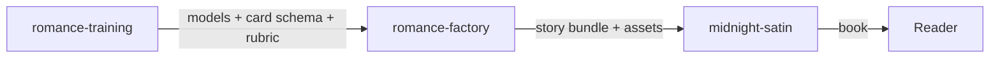
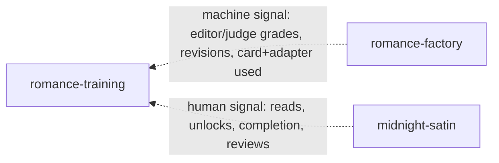

# Romance Project — System Architecture

**Status:** Living architecture doc (Jul 2026)
**Scope:** How **romance-training (RT)**, **romance-factory (RF)**, and **midnight-satin (MS)** work together — the forward artifact flow, the backward feedback loops, and the contracts at each boundary.

This repo owns **no runtime code**. It owns the *map*, the *cross-cutting contracts*, and the *design principles* that keep three independently-deployed systems coherent. Each system keeps its own repo, remote, CI, and deploy cadence.

---

## The systems

| Repo | Role | Stack | Deploy |
|------|------|-------|--------|
| **romance-training (RT)** | Trains the models: **judge**, **editor**, **writer** | Python / Unsloth / Gemma 4 MoE, on DGX Spark | Ships model artifacts (GGUF/LoRA) + contracts |
| **romance-factory (RF)** | The **harness**: runs the models, drafts → grades → revises → merges into finished books; emits generation telemetry | Python generate pipeline | Produces story bundles |
| **midnight-satin (MS)** | The **frontend**: readers discover, read, unlock, review, comment; captures reader signal | Next.js 16 / Vercel / Neon Postgres | Vercel (git-integrated) |

### RT's three products (never cross-trained)

- **Judge** — scores prose against the Leech & Short rubric + a steering card. The independent referee.
- **Editor** — grades and rewrites style at sentence / span / act grain. The writer's critic.
- **Writer** — card-conditioned MoE base + swappable voice/genre LoRA adapters that generates on-card prose.

Governing rule: **judge, editor, and writer are separate training products.** Never overwrite one checkpoint with another's data, and keep the referee judge held out from the writer's reward loop.

### Resolved — romance-editor is superseded

**romance-editor** was an early attempt to isolate the editing model as its own product (Qwen3-8B QLoRA on Style-in-Fiction, single-3090 scale). **Decision (Jul 2026): abandon it; the editor stays inside romance-training.**

Rationale: editing and writing are tightly interlinked, and — critically — the **Leech & Short style-classification data is shared across all three products.** The same labeled corpus that teaches the judge to score also teaches the editor to rewrite and the writer to generate on-card. Forking the editor into its own repo would fork that shared data substrate and duplicate the labeling pipeline. romance-editor is kept only as historical reference, not as a pillar of the architecture.

> This is the deeper reason RT is one repo, not three: the products share a **model** base family *and* a **data** substrate (the classification labels). Keep them co-located; keep the checkpoints separate.

---

## Standing conventions

Project-wide rules of thumb, owned here because this repo is the coordination hub as MS/RF/RT converge. They hold until explicitly revised in this doc.

- **Legacy support = dropped.** We are early-stage; optimize for new work, not backward compatibility. Do **not** add code to support legacy generations. In particular, RF's pre-existing `stories/` bundles predate the card/provenance system and are **unsupported** — build for **new generations only**, with no backfill or compatibility shims. The contracts here (steering card, provenance) are therefore **forward-only**.
- **Separate training products** (established): judge, editor, and writer are never cross-trained; the referee judge is held out from the writer's reward loop.

---

## Forward flow — artifacts move RT → RF → MS

**RT → RF (model artifacts).** Quantized base + writer adapters + editor + judge (GGUF/LoRA), the shared `steering_card` schema, and the rubric version. RF loads these and runs the draft→grade→revise loop.

**RF → MS (story bundle).** A self-contained story directory — `author_profile.json`, `book_cover.json`, `character_dossiers.json`, `story_outline.json`, `publish_manifest.json`, `chapters/chapter_NN.md`, `publish_images/`. This edge is **already real and contracted**: see MS `docs/ROMANCE_FACTORY_INGEST.md` and the consumer gap list in `docs/ROMANCE_FACTORY_GAPS.md`. Ownership boundary: RF owns content + assets + metadata; MS validates, imports to Neon, and presents.

Operational note: SDXL cover/portrait generation runs on the **mac mini after ejecting the prose LLM from LM Studio** — that box does prose *or* images, not both at once (see RT `docs/LLM-Backends.md` for hosting).

---

## Backward flow — the feedback loops (mostly greenfield)

Two loops feed learning back to RT. They carry **different signals and must not be conflated.**

### Loop 1 — RF observation (machine signal)

Editor grades, judge scores, revision counts, which card + adapter produced each passage, where drafts failed. Measures **fidelity to the card**: "did it write what it was told." Abundant, cheap, fast — but **circular** (same rubric the models trained on). It cannot tell you the rubric is any good.

### Loop 2 — MS analytics (human signal)

Reader behavior. Measures **appeal**: "do readers actually want this." Sparse, slow, noisy, confounded — but the **only non-circular signal** in the system, and the closest thing to ground truth.

**Status:** the signal *tables* exist in MS's Neon schema, but there is **no export, no analytics pipeline, nothing feeding RT.** This loop is greenfield.

---

## The two-signal rule (the core principle)

There is a **proxy hierarchy**: computable metrics → editor/judge (rubric proxy) → reader appeal (near-truth). Each layer should be validated by the one above it.

**The human signal's primary job is to calibrate the machine proxies — not to directly reward the writer.** If reader appeal and editor scores diverge, the first response is to *fix the rubric/editor*, not to retrain the writer to chase engagement. MS is the ecosystem-level independent referee, the same way the judge is the independent referee within training.

Only *after* the proxies are calibrated against humans do MS-derived preferences (story A > B for the same card) become writer preference-training data — and even then, gated.

> **Decision (recommended, open for revision):** treat MS human signal as **proxy-calibration + curated, de-confounded preference data**, *not* a tight direct-optimization reward. Rationale: the provenance chain is currently severed (below) and the signal is confounded by featuring/paywalls — neither is safe to close a tight loop through. Revisit once provenance is fixed and confounds are controlled.

---

## Reader-signal inventory (from MS schema)

Ranked by trustworthiness — **revealed preference** (what readers did, at a cost) beats **stated preference** (what they said).

| Signal | MS source | Type | Strength |
|--------|-----------|------|----------|
| Bought the paperback | `paperback_orders` | Revealed (costly) | **Strongest** |
| Paid credits to read past the Veil | `chapter_unlocks` + `credit_transactions` | Revealed (costly) | **Strong** |
| Where readers stop | `reading_progress.scroll_percent` (per chapter) | Behavioral, **localized** | **Strong** — drop-off = where prose lost them |
| Star rating + text | `novel_reviews.star_rating` | Stated | Medium |
| Chapter reactions | `comments` (threaded, `like_count`) | Stated, needs NLP | Medium |
| Character affinity | `characters.endorsement_count` | Stated | Medium |
| Voice affinity | `author_follows` | Behavioral | Medium |
| Save intent | `reader_bookmarks` | Weak behavioral | Weak |

`reading_progress.scroll_percent` is the standout: a per-chapter drop-off point is a localized "the prose lost me here" signal that — **with provenance** — maps back to the span/act/card that composed that passage. That is a direct line to editor/writer training signal at span grain.

---

## Failure-mode design principles

The known ways generate→train ecosystems rot. Each is a standing constraint.

1. **Model collapse.** Training the writer on its own RF outputs degrades diversity over generations. → Every training round is **anchored with real human-authored corpus** and held-out real prose; RF output is *candidate* data, never the whole diet.
2. **Goodhart / reward hacking.** A direct engagement reward produces bait and formula, and gets the rubric gamed. → Human signal calibrates proxies (two-signal rule); keep the judge held out from both the editor and the reader loop.
3. **Confounded human signal.** `novels.is_featured` / `featured_order`, the Veil paywall (`is_free`), and `news_articles` of type `popularity`/`ranking` drive reads independent of prose quality. → Any "this book did better" signal must **control for placement, promotion, and paywall** (hold presentation constant; A/B the same story under different cards/adapters) before it is trusted for attribution.
4. **Cadence mismatch + provenance.** Human signal arrives weeks late; training wants batches now. → Treat feedback as a **slow calibration channel**, not a live gradient; version-stamp everything crossing a boundary.
5. **Privacy & consent.** MS is real users and adult content. → Reader behavior as training data needs consent and age-gating handled **in the contract**, not as an afterthought.

---

## The provenance gap (fix this first)

For any reader outcome to inform training, RT must know **which writer adapter, which steering card, which model version** produced each chapter. Today:

- the RF → MS bundle carries **no model provenance**, and
- MS stores chapters as plain `content TEXT` with **zero style metadata**.

So even with perfect reader signal, "readers dropped off at chapter 7" cannot be joined to "chapter 7 was written by the `dark-fantasy` adapter under card X by model v3." **The provenance chain is severed at the RF → MS handoff.**

This is a **data-contract fix, not an ML problem**, and it is the prerequisite for the entire backward flow. Specified in **[PROVENANCE.md](PROVENANCE.md)**.

Note: git-level pinning (a manifest of known-good commits) gives *release*-granularity reproducibility, but the loop needs *per-story* provenance in the **data**. Don't conflate the two.

---

## Pre- vs post-deployment evaluation

- **Pre-deployment gate:** RT's Phase 5A bake-off — does a model clear the quality bar before it ships to RF?
- **Post-deployment continuous eval:** RF observation + MS analytics — the **proving ground** where shipped models earn their keep against real readers.

---

## Where contracts live

| Contract | Canonical home | Mirrored/summarized here |
|----------|----------------|--------------------------|
| Story bundle (RF → MS) | MS `docs/ROMANCE_FACTORY_INGEST.md` | Referenced, not duplicated |
| Consumer gaps (MS ← RF) | MS `docs/ROMANCE_FACTORY_GAPS.md` | Referenced |
| Model artifacts (RT → RF) | RT `docs/PHASE5_STYLE_STEERING.md`, `MOE_WRITER.md` | Referenced |
| **Steering card (RT vocab → RF authoring → MS provenance)** | **This repo — [contracts/STEERING_CARD.md](contracts/STEERING_CARD.md)** | Owned here (canonical shape + cascade) |
| **Identifiers & segmentation (story→chapter→act→span)** | **This repo — [contracts/IDENTIFIERS.md](contracts/IDENTIFIERS.md)** | Owned here (hierarchy + ids + stitch offsets) |
| **Per-story provenance (RT → RF → MS)** | **This repo — [PROVENANCE.md](PROVENANCE.md)** | Owned here (spans all three) |

Provenance lives here precisely because it spans all three systems and has no single owner otherwise.

---

## Open decisions

1. **Human-signal role:** confirm the recommended calibration-first stance vs a tighter optimization loop.
2. **Provenance ownership:** RF stamps and carries it; does MS *store* it (schema columns) or just *retain* the RF receipt keyed by novel/chapter? (PROVENANCE.md proposes storing a minimal join key.)
3. **Umbrella mechanics:** manifest-only (current) vs promote to git submodules if atomic historical checkout becomes necessary.

### Resolved

- **romance-editor** (Jul 2026): superseded — editor stays in romance-training; the three products share the style-classification data substrate. See *Resolved — romance-editor is superseded* above.
