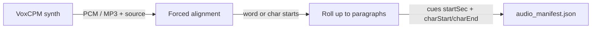

# Audiobook Contract

**Status:** Adopted (Jul 2026) — product rules locked; RF/RV cues + MS ingest/player still open
**Spans:** romance-voice (RV) · romance-factory (RF) · midnight-satin (MS)
**Scope:** New generations only — audiobook is a required part of a complete publish bundle (see [ARCHITECTURE.md](../ARCHITECTURE.md)).
**Related:** [IDENTIFIERS.md](IDENTIFIERS.md), [PROVENANCE.md](../PROVENANCE.md), [ARCHITECTURE.md](../ARCHITECTURE.md), MS `docs/ROMANCE_FACTORY_INGEST.md` (MS-3 will extend)

How narrated audio is produced, packaged into the story bundle, unlocked in Midnight Satin, and kept in sync with the reading room.

---

## 1. Product rules (DEC-4)

| Rule | Decision |
|------|----------|
| **Bundle** | Every complete RF publish package includes `audio/` + `audio_manifest.json` as first-class story data — not an optional sidecar. |
| **Unlock** | **1 credit** unlocks the novel’s audiobook stream (`AUDIOBOOK_UNLOCK_COST = 1`). Idempotent; same credit-transaction pattern as chapter unlock. |
| **Veil gate** | Audio may play **only through chapters the reader may already see** (free chapter 1 + `chapter_unlocks`). Paying for audio does **not** unlock chapter text. |
| **Sync UX** | Not continuous scroll. When the next **paragraph cue** starts, the reading room **jumps/scrolls to that paragraph**. |
| **Background** | Narration continues while the app is backgrounded (Media Session / OS audio focus where the platform allows). |


### Playback eligibility

A chapter’s audio is playable iff **both**:

1. The reader has an audiobook unlock for this novel, and
2. The chapter is free (`is_free`) **or** present in `chapter_unlocks` for that reader.

Free chapter 1 is playable after audiobook unlock without a chapter unlock. Paid chapters need **both** Veil unlock and audiobook unlock.

---

## 2. Ownership

| Concern | Owner |
|---------|--------|
| VoxCPM synthesis HTTP serve (Spark) | **RV** |
| Forced alignment → paragraph cues (stable-ts post-process) | **RV** (on Spark, after synth) |
| Batch CLI / engine library; land `audio/` on the story tree | **RF** |
| Include `audio/` in phase 15b / `romance-bundle.zip` | **RF** |
| Import: MP3s → blob, cues → Neon | **MS** |
| 1-credit unlock, Veil-capped player, jump-sync, background playback | **MS** |

RF remains the content owner. RV is the Spark TTS service. MS validates, stores, and presents.

---

## 3. Bundle layout (RF → MS)

Extend the story directory (alongside existing chapters / images / provenance):

```text
<audio>/
├── audio_manifest.json
└── chapter_NN/
    └── act_MM.mp3          # existing RF per-act layout
```

A complete publish package **requires** `audio/audio_manifest.json` with paragraph cues (see §4). Prefer **fail closed** at publish/import: no cues → not a complete bundle / no player until cues exist. Legacy bundles without audio remain unsupported (forward-only).

---

## 4. `audio_manifest.json` (schemaVersion `1.1`)

Extends today’s RF schema (`schemaVersion`, `storyId`, `voice`, `engine`, `segments[]` with `chapterNumber` / `actNumber` / `filename` / `durationSec` / `byteSize`) with **paragraph cues** required for jump-sync.

```jsonc
{
  "schemaVersion": "1.1",
  "storyId": "<uuid>",          // same story_id as provenance / publish_manifest
  "voice": "...",
  "engine": "voxcpm",
  "ttsNarratorVoice": "...",    // optional; from author_profile
  "segments": [
    {
      "chapterNumber": 1,
      "actNumber": 1,
      "filename": "chapter_01/act_01.mp3",
      "source": "acts_verified",
      "durationSec": 142.5,
      "byteSize": 1234567,
      "cues": [
        {
          "startSec": 0.0,
          "chapterNumber": 1,
          "charStart": 0,         // inclusive, chapter body coordinate space
          "charEnd": 180          // exclusive
        },
        {
          "startSec": 12.4,
          "chapterNumber": 1,
          "charStart": 180,
          "charEnd": 410
        }
      ]
    }
  ]
}
```

### Cue rules

- Grain is **paragraph**, not word. No word-level timestamps in v1.
- `cues[]` are ordered by `startSec` ascending within each segment.
- `charStart` / `charEnd` are offsets in the **final chapter body text** — the same coordinate space readers see and that provenance stitch offsets use ([IDENTIFIERS.md](IDENTIFIERS.md) §3). Blank-line–separated paragraphs in the published chapter body.
- Ownership: **RF/RV produce cues at synth time**; **MS consumes them**. MS does not invent timing.

Engine/voice fields in the manifest are **audio provenance** for the player and ops — they are not required for the RT feedback loop (see [PROVENANCE.md](../PROVENANCE.md)).

---

## 4b. Alignment bridge — how paragraph cues are produced

VoxCPM **does not** stamp timing into the audio during synthesis (autoregressive; no reliable per-word timestamps at generate time). Timing is a **post-process**, same shape as a forced-alignment / transcription pipeline: known text + known audio → timestamps.



### Pipeline (RV owns on Spark; RF consumes the zip)

1. **Synthesize** per act (or chunk) with VoxCPM as today — unload when idle.
2. **Align** each segment’s audio against the exact text that was spoken, using VoxCPM’s optional **stable-ts** path (`pip install "voxcpm[timestamps]"` → `StableTSAligner` / `align_audio_file`, word-level preferred; char-level is best-effort derived).
3. **Roll up** word/`char` starts to **paragraph** boundaries in the published chapter body (blank-line paragraphs; same coordinate space as §4).
4. **Write** `cues[]` into `audio_manifest.json` (`schemaVersion` `1.1+`). Job download zip must include cues; a bundle without cues is incomplete.

### Requirements (RV)

| Req | Detail |
|-----|--------|
| Deps | `voxcpm[timestamps]` (stable-ts) in the Spark TTS venv (`~/venvs/rf-tts`); do not put this in the LM Studio path |
| Input | Per-segment audio + the verbatim text fed to synth (or the paragraph-sliced chapter body for that segment) |
| Output | `cues[]` with `startSec`, `chapterNumber`, `charStart`, `charEnd` |
| Fail closed | Job fails or marks incomplete if alignment cannot produce cues for a segment |
| GPU tenancy | Alignment may use GPU; still unload VoxCPM when idle; prefer running align after synth unload if VRAM is tight |
| Language | Default English (`--timestamp-language en`) unless the story declares otherwise |

Word-level timestamps may exist **internally** for rollup; they are **not** shipped to MS in v1 (AUDIOBOOK §6). Only paragraph cues leave the Spark job.

---

## 5. Midnight Satin product surface

### Ingest / storage (DEC-5)

Split by payload shape:

| Artifact | Where | Why |
|----------|-------|-----|
| **MP3s** (large binary) | **Blob** (Vercel Blob / CDN) | Streamable, cacheable, not suited to Postgres |
| **Paragraph cues** (small JSON) | **Neon JSONB** | Hydrate with chapter text for jump-sync; gate by unlock in the same API; no extra CDN fetch; tiny vs chapter prose |
| **`audio_manifest.json` in the RF bundle** | Publish source of truth at import | Importer reads it once → puts MP3s in blob, cues (+ URLs / duration) into Neon |

Do **not** serve cue JSON primarily from blob for the reading room. Blob is fine as a cold copy of the full manifest for ops/re-import; the **player reads cues from Neon** (novel- or chapter-scoped JSONB owned by MS). Filter cues server-side to chapters the reader may hear (Veil + audiobook unlock) before returning them to the client.

- Document the importer contract in MS `docs/ROMANCE_FACTORY_INGEST.md` and gaps in `ROMANCE_FACTORY_GAPS.md` (backlog **MS-3**).

### Unlock

- `AUDIOBOOK_UNLOCK_COST = 1`.
- Novel-scoped unlock record + `credit_transactions` type `audiobook_unlock` (amount `-1`).
- Idempotent: re-unlock does not deduct again.

### Reading room

- Client gets **signed/CDN MP3 URLs** (blob) + **cues from Neon** (via reading-room API).
- On each cue boundary (`currentTime` crosses `startSec`): scroll/jump to the paragraph covering `[charStart, charEnd)` (e.g. `scrollIntoView`). Not continuous auto-scroll.
- Optional paragraph highlight is deferred; jump is the v1 requirement.
- **Background playback** required: keep narration running when the app is backgrounded; use Media Session / lock-screen controls where the platform allows.

---

## 6. Explicit non-goals (v1)

- Audio does **not** bypass The Veil or unlock chapter text.
- No continuous auto-scroll with the playhead.
- No word-level timestamps **shipped to MS** (alignment may use them internally).
- No MS inventing cues when the manifest lacks them — require cues for a playable audiobook.
- No storing MP3 binaries in Neon.

---

## 7. Parallel tracks & status

Two tracks can proceed in parallel after the contract (this doc):

**Track A — RV produce (Spark)**  
RV-1 live synth → RV-2 alignment bridge → RF-4 client → RF-5 bundle includes `audio/` with cues.

**Track B — MS consume (Vercel / Neon)**  
MS-3 ingest (blob MP3s + Neon cues) → MS-4 unlock + player + jump-sync + background. Can stub the player against fixture cues/MP3s before Track A lands.

| Piece | Status | Backlog |
|-------|--------|---------|
| Product rules (this contract) | **Adopted** | DEC-4 |
| Cues in Neon, MP3s in blob | **Adopted** | DEC-5 |
| Live VoxCPM on Spark | Open | RV-1 |
| Forced-alignment → paragraph cues on Spark | Open | RV-2 |
| RF HTTP client → land `audio/` | Open | RF-4 |
| Include cued `audio/` in publish bundle | Open | RF-5 |
| MS ingest: blob MP3s + Neon cues | Open | MS-3 |
| MS unlock + Veil-capped player + jump-sync + background | Open | MS-4 |
